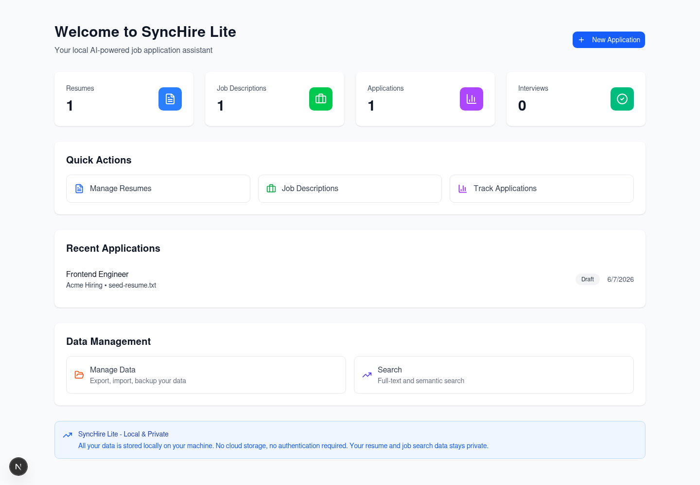

# SyncHire (知遇)

<p align="center">
  <strong>The AI-powered job application command center for people who refuse to send generic resumes.</strong>
  <br />
  Build sharper resumes, decode job descriptions, manage every opportunity, and walk into interviews with a plan.
</p>

<p align="center">
  <a href="./README.md"><strong>English</strong></a>
  ·
  <a href="./README.zh-CN.md">简体中文</a>
</p>

<p align="center">
  <a href="https://opensource.org/licenses/MIT"></a>
  
  
  
  
  
</p>

<p align="center">
  
</p>

## The Product Pitch

Job hunting should not feel like throwing your career into a black box.

SyncHire is built for one clear promise: turn every application into a targeted, measurable, high-confidence campaign. It brings your resume, job descriptions, match scoring, interview preparation, application tracking, and data portability into one focused workspace. No more scattered files, half-finished notes, lost links, or guessing whether your resume actually speaks the language of the role.

Use SyncHire in local-first Lite mode when you want a private, fast, no-backend workflow. Turn on the full stack when you want AI analysis, vector matching, API-backed persistence, OAuth, 2FA, object storage, and production-grade infrastructure.

## Why SyncHire Wins

| What job seekers usually fight                | What SyncHire gives them                              |
| --------------------------------------------- | ----------------------------------------------------- |
| One resume sent everywhere                    | Role-specific resume and job-description workflows    |
| Job links buried in tabs and notes            | A structured application pipeline                     |
| Vague "looks good" feedback                   | Match scores, gaps, and next actions                  |
| Interview prep starting too late              | Role-aware prep generated from the actual opportunity |
| Data trapped in a product                     | JSON/CSV export, import preview, and local backups    |
| Fragile demos that need every service running | Lite mode that works locally without backend noise    |

## What You Can Do

- Upload and manage resumes with visible validation for file type and size.
- Save job descriptions manually or preserve job URLs when auto-import is unavailable.
- Create local applications from a resume and a job description in minutes.
- Track application status, notes, search views, interviews, analytics, and saved searches.
- Export, import, and back up your data from a dedicated data management console.
- Connect a full backend for AI-powered resume analysis, job matching, interview prep, authentication, storage, and vector search.

## Product Modes

| Mode            | Best for                                                     | What runs                                                           |
| --------------- | ------------------------------------------------------------ | ------------------------------------------------------------------- |
| Lite Mode       | Private local workflows, demos, offline-friendly exploration | Next.js frontend, browser local storage, no required API            |
| Full Stack Mode | AI features, team deployments, API-backed persistence        | Next.js, FastAPI, PostgreSQL + PGVector, Redis, Minio, MCP services |

## Core Capabilities

### Resume Intelligence

Upload PDF, DOC, DOCX, or TXT resumes, extract structured content, and keep the resume attached to the application workflow where it matters. SyncHire treats the resume as a living asset, not a forgotten attachment.

### Job Description Command Center

Capture job descriptions, company context, requirements, skills, and links in a structured format. Every role becomes something you can compare, analyze, and act on.

### Match and Gap Analysis

The full AI workflow is designed to score fit, identify missing skills, surface keyword gaps, and recommend stronger positioning. The product goal is simple: make every application more intentional than the last.

### Interview Preparation

Generate role-specific technical, behavioral, HR, and STAR-method prep from the opportunity itself. SyncHire helps you prepare for the conversation you are actually walking into.

### Data Ownership

Export JSON or CSV, preview imports, resolve conflicts, and keep local backup metadata. Your job search is strategic data; SyncHire keeps it accessible.

## Architecture

```text
SyncHire/
├── frontend/        Next.js 16 app, Lite mode UX, E2E coverage
├── api/             FastAPI backend, auth, data, AI orchestration
├── mcp-servers/     Modular AI services for parsing, matching, and prep
├── db/              Database schema and migrations
├── deploy/          Deployment assets
├── k8s/             Kubernetes manifests
├── docs/            Engineering and product documentation
└── docker-compose.yml
```

### Technology Stack

| Layer    | Stack                                                                           |
| -------- | ------------------------------------------------------------------------------- |
| Frontend | Next.js 16.2.7, React 19.2.7, TypeScript, Tailwind CSS, Zustand, TanStack Query |
| Backend  | FastAPI, Python 3.11+, Pydantic, PyJWT                                          |
| Data     | PostgreSQL 16, PGVector, Redis, Minio                                           |
| AI       | OpenAI, Anthropic, modular MCP servers                                          |
| Quality  | Vitest, Playwright, Pytest, Ruff, Black, Bandit, pip-audit, ESLint              |

## Quick Start

### Prerequisites

- Node.js 22+ and npm 10+
- Python 3.11+
- Docker and Docker Compose
- Git

### Option 1: Run Lite Mode

Lite Mode is the fastest way to experience the product. It does not require the backend.

```bash
git clone https://github.com/Rethymus/SyncHire.git
cd SyncHire
npm install
npm run dev:frontend
```

Open:

```text
http://localhost:3000
```

### Option 2: Run the Full Stack

Use this when you want the API, database, object storage, AI services, and full platform behavior.

```bash
git clone https://github.com/Rethymus/SyncHire.git
cd SyncHire
cp .env.example .env
npm install
npm run docker:up
npm run db:migrate
npm run dev
```

Service URLs:

| Service       | URL                        |
| ------------- | -------------------------- |
| Frontend      | http://localhost:3000      |
| API           | http://localhost:8000      |
| API Docs      | http://localhost:8000/docs |
| PostgreSQL    | localhost:5432             |
| Minio Console | http://localhost:9001      |

AI features require provider keys in `.env`:

```bash
OPENAI_API_KEY=sk-your-openai-key
ANTHROPIC_API_KEY=sk-ant-your-anthropic-key
```

## Developer Commands

```bash
# Development
npm run dev
npm run dev:frontend
npm run dev:api
npm run dev:mcp

# Infrastructure
npm run docker:up
npm run docker:down
npm run docker:logs
npm run db:migrate

# Frontend quality
npm run type-check --workspace=frontend
npm run lint:nocache --workspace=frontend -- --max-warnings=0
npm test --workspace=frontend
npm run test:integration --workspace=frontend
npm run test:e2e --workspace=frontend
npm run build --workspace=frontend

# Backend quality
cd api
pytest -q -W error --tb=short
ruff check .
black --check .
bandit -q -r app main.py
pip check
pip-audit
```

## Quality Bar

The current QA baseline is intentionally strict because a job-search tool cannot feel fragile.

| Gate                       | Current baseline                                                                   |
| -------------------------- | ---------------------------------------------------------------------------------- |
| Backend tests              | 344 passing with warnings treated as errors                                        |
| Frontend unit tests        | 320 passing                                                                        |
| Frontend integration tests | 18 passing                                                                         |
| Playwright E2E             | 13 passing                                                                         |
| Route dogfood sweep        | 13 key routes across desktop and mobile, HTTP 200, zero console errors or warnings |
| Security checks            | Bandit, pip-audit, pip check passing                                               |
| Production build           | Passing                                                                            |

The full exploratory QA report lives in [dogfood-output/report.md](dogfood-output/report.md).

## Roadmap

- Deeper AI resume rewrites with explainable changes.
- Better job-source importing and enrichment.
- Stronger interview simulation loops.
- Collaboration workflows for mentors, recruiters, and career coaches.
- Deployment-ready observability, alerts, and analytics dashboards.

## Contributing

We welcome focused contributions that make the job-search workflow sharper, faster, more reliable, or more humane.

1. Fork the repository.
2. Create a feature branch.
3. Keep changes scoped and tested.
4. Run the relevant quality gates.
5. Open a pull request with a clear product impact summary.

Commit messages should follow conventional commits:

```text
feat: add role-specific interview prep flow
fix: preserve job URL during import fallback
docs: refresh bilingual README
```

## License

SyncHire is released under the [MIT License](https://opensource.org/licenses/MIT).
