# SyncHire (知遇)

<p align="center">
  <strong>为不甘心投递模板简历的人打造的 AI 求职作战中心。</strong>
  <br />
  打磨简历、拆解岗位、管理机会、准备面试，把每一次投递都变成有策略的出击。
</p>

<p align="center">
  <a href="./README.md">English</a>
  ·
  <a href="./README.zh-CN.md"><strong>简体中文</strong></a>
</p>

<p align="center">
  <a href="https://opensource.org/licenses/MIT"></a>
  
  
  
  
  
</p>

<p align="center">
  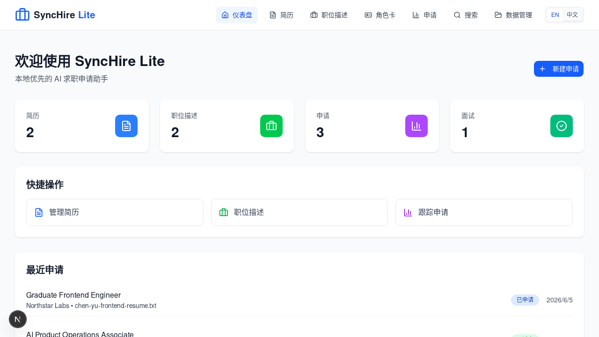
</p>

## 产品宣言

求职不应该像把职业生涯扔进一个黑箱。

SyncHire 只为一个目标而生：让每一次投递都更有策略、更可衡量、更有胜算。它把简历、职位描述、候选人角色卡、个性化 PDF 导出、匹配分析、面试准备、申请进度、浏览器辅助填表和数据备份放进同一个工作台。你不再需要在文件夹、浏览器标签、备忘录和聊天记录之间来回翻找，也不必猜测“这份简历到底有没有说到岗位重点”。

想快速体验，可以直接使用本地优先的 Lite 模式，不依赖后端、不制造 API 报错噪音，个人资料始终留在你的设备上。想打开完整能力，可以启用全栈模式，接入 AI 分析、向量匹配、后端持久化、OAuth、2FA、对象存储和生产级基础设施。

## 为什么是 SyncHire

| 求职者常见痛点               | SyncHire 的答案                   |
| ---------------------------- | --------------------------------- |
| 一份简历投所有岗位           | 围绕具体岗位组织简历和职位描述    |
| 岗位链接散落在标签页和笔记里 | 结构化的申请管线                  |
| 只有“感觉还行”的模糊反馈     | 匹配度、差距和下一步动作          |
| 面试准备总是太晚开始         | 基于真实岗位生成准备内容          |
| 数据被困在产品里             | JSON/CSV 导出、导入预览、本地备份 |
| 演示环境必须全服务启动       | Lite 模式本地可用，无后端依赖     |
| 网页投递表单反复填写         | Agent 辅助预填，但提交权永远在你手里 |

## 你可以用它做什么

- 上传并管理简历，明确校验文件类型和 10MB 大小限制。
- 手动保存职位描述；当自动导入不可用时，保留原始岗位 URL 并给出清晰提示。
- 用一份简历和一份职位描述，在几分钟内创建本地申请记录。
- 维护本地候选人角色卡，用它驱动个性化简历和浏览器填表建议。
- 在本地生成简历 PDF，不把个人信息上传到云端。
- 为 Kimi WebBridge 这类浏览器 agent 生成填表指令，明确排除所有提交控件。
- 审核系统填写的字段，像真实用户一样修改，并且只有明确同意后才把修改学习回角色卡。
- 跟踪申请状态、备注、搜索视图、面试、分析和收藏搜索。
- 在数据管理台导出、导入、预览冲突并维护本地备份记录。
- 接入完整后端，启用 AI 简历分析、岗位匹配、面试准备、认证、存储和向量搜索。

## 中文 Linux 实测截图

以下截图来自 2026 年 6 月 8 日的 Linux standalone 生产验证。本轮测试在本地启动 SyncHire，注入应届生求职场景数据，切换到中文界面，并真实走查完整 Lite 流程：仪表盘、简历、职位描述、申请详情、岗位化简历生成、本地 PDF 导出、角色卡辅助填表、匹配分析、面试准备、数据分析、搜索、数据管理和设置。

### 核心流程

| 仪表盘 | 简历管理 |
| ------ | -------- |
|  | 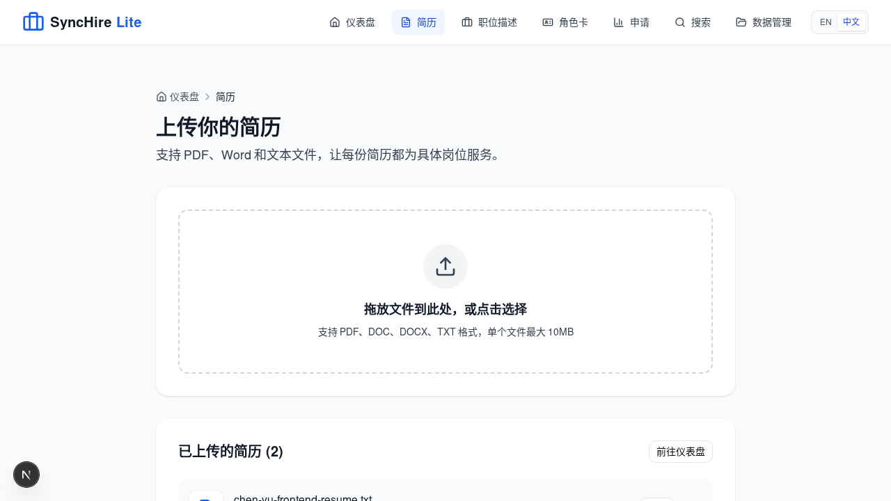 |

| 职位描述 | 申请跟踪 |
| -------- | -------- |
| 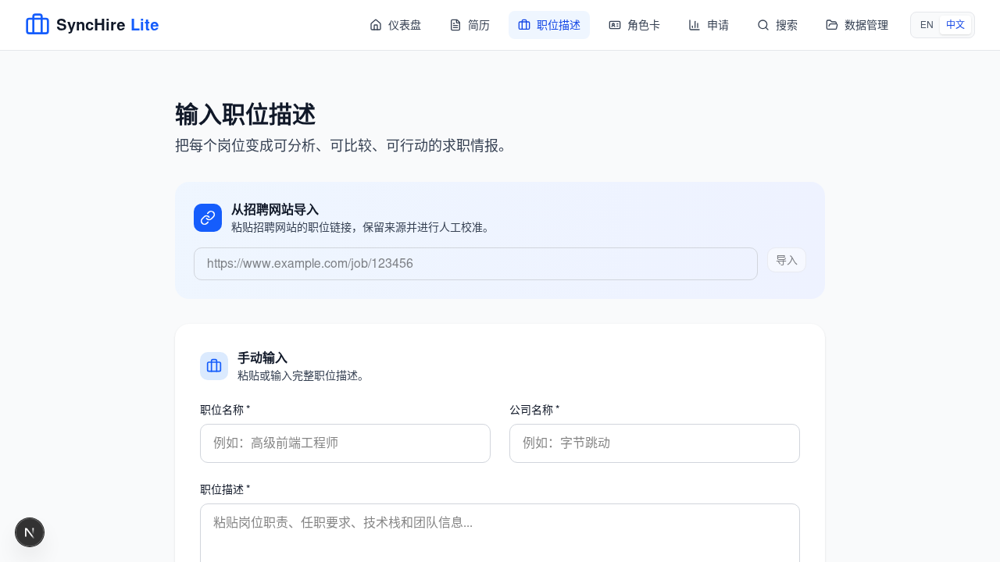 | 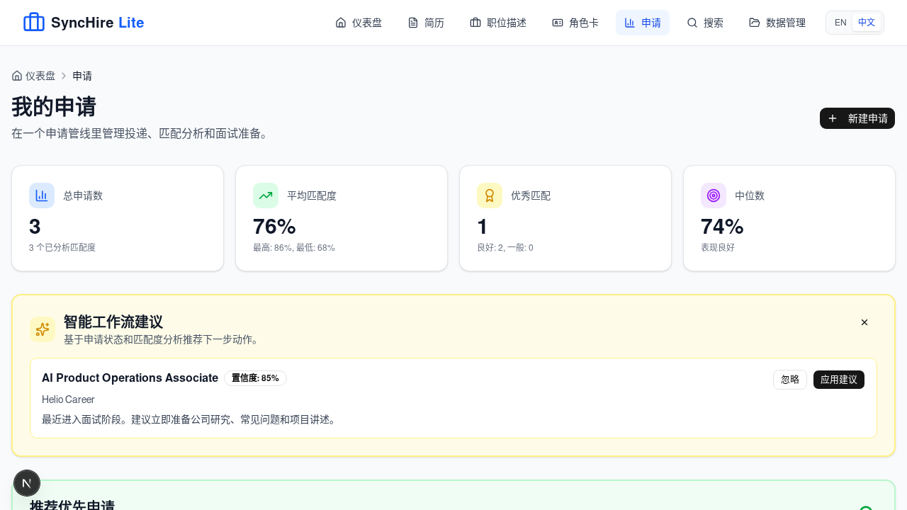 |

### 简历生成与浏览器 Agent

| 申请详情 | 岗位化简历与 PDF |
| -------- | ---------------- |
| 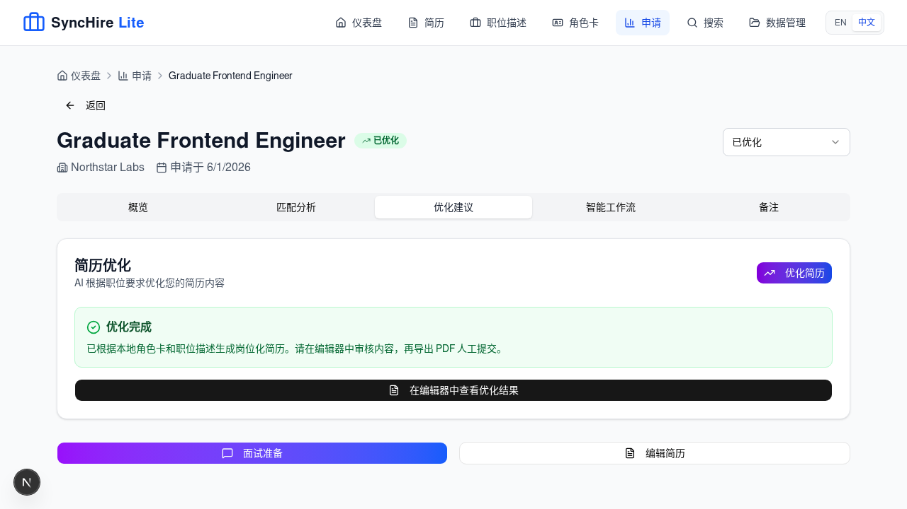 | 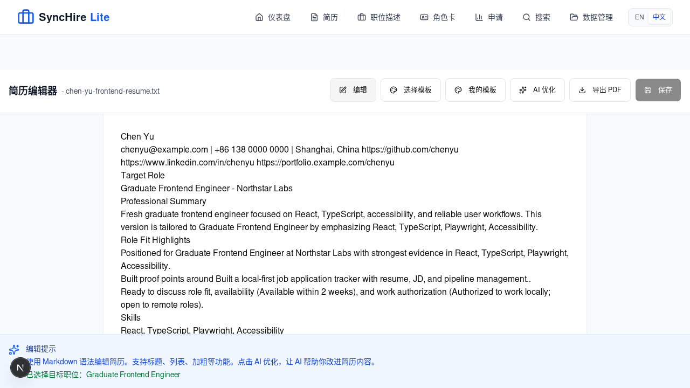 |

| 角色卡与浏览器填表 | 匹配分析 |
| ------------------ | -------- |
| 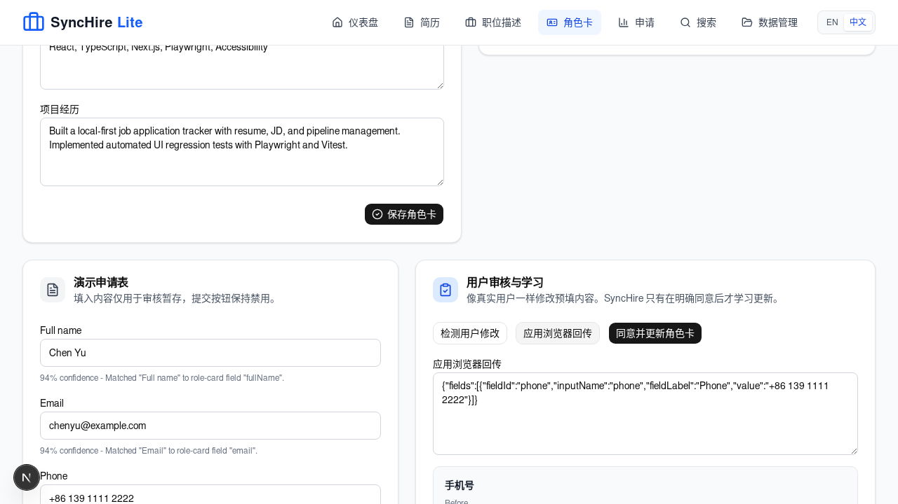 | 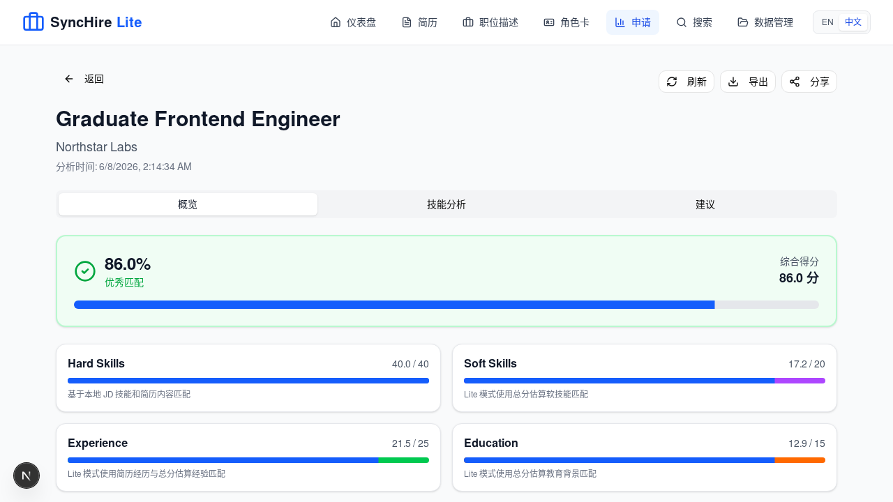 |

### 洞察与搜索

| 面试准备 | 数据分析 |
| -------- | -------- |
| 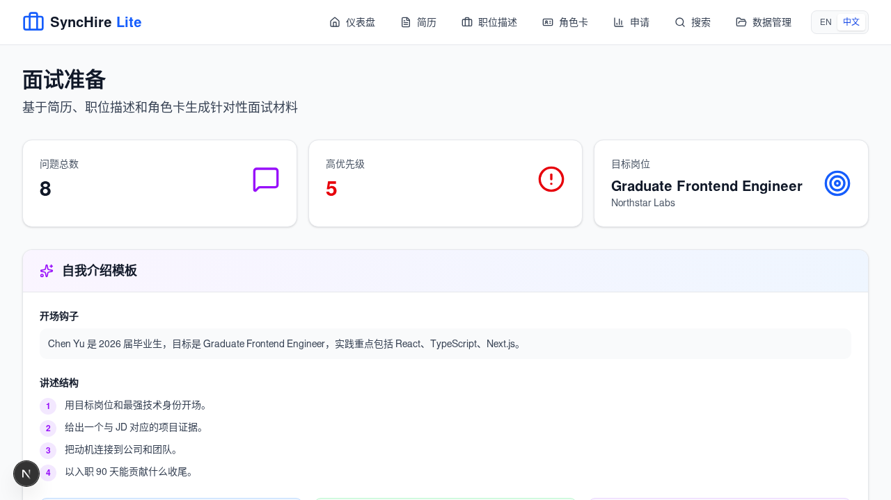 | 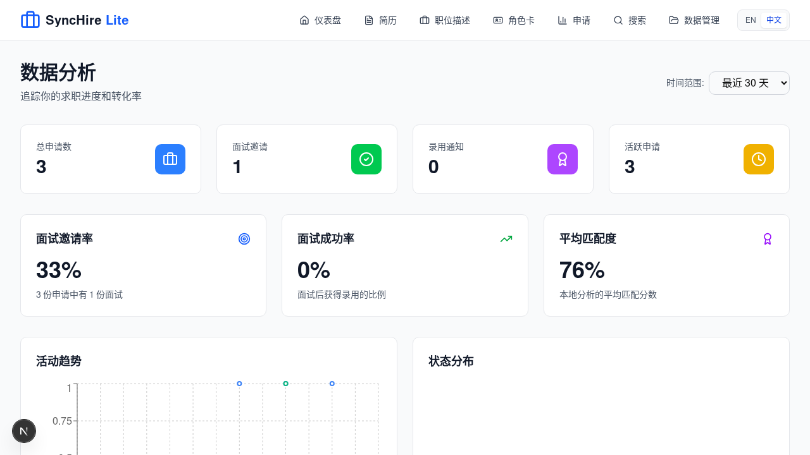 |

| 本地搜索 | 数据管理 |
| -------- | -------- |
| 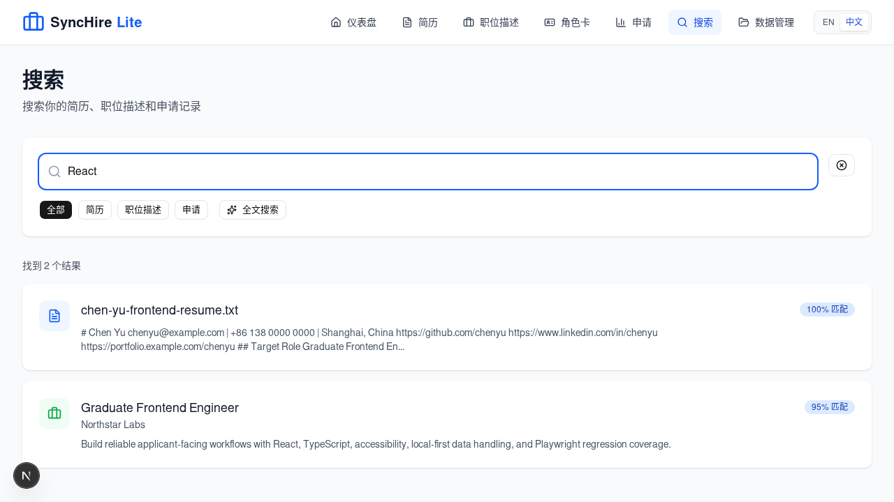 | 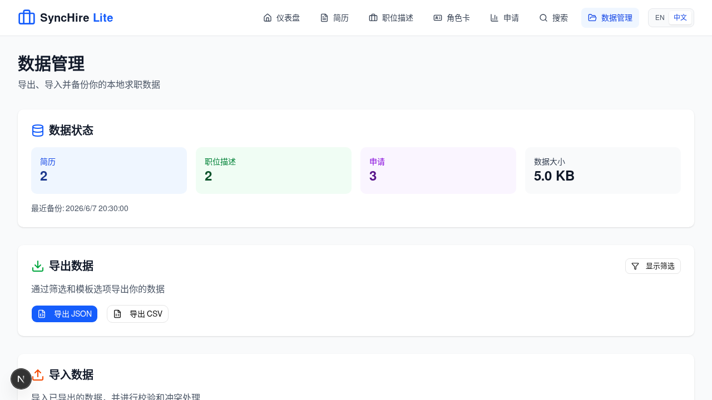 |

| 简历搜索 | 职位描述搜索 |
| -------- | ------------ |
| 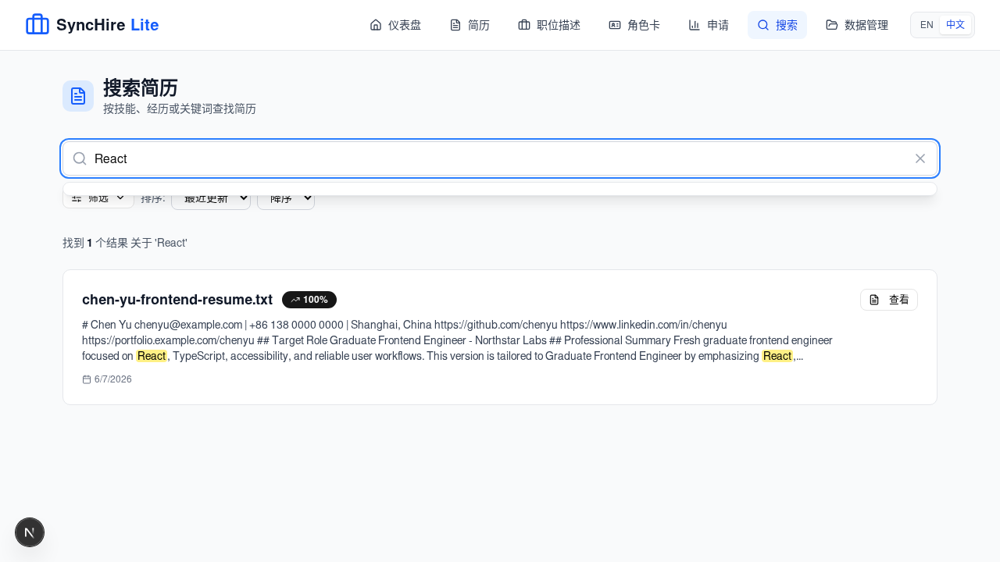 | 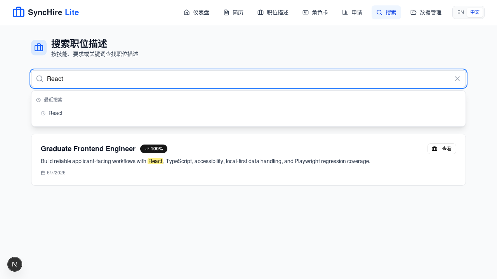 |

| 申请搜索 | 设置 |
| -------- | ---- |
| 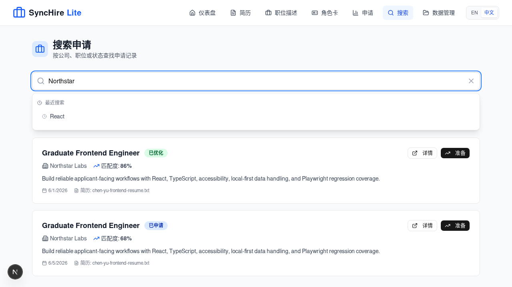 | 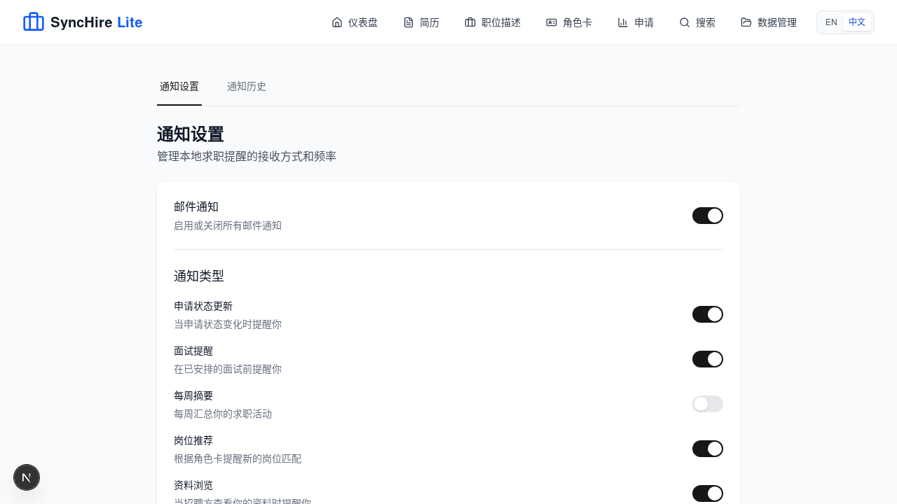 |

## 产品模式

| 模式      | 适合场景                           | 运行内容                                                        |
| --------- | ---------------------------------- | --------------------------------------------------------------- |
| Lite 模式 | 本地隐私工作流、产品演示、轻量探索 | Next.js 前端、浏览器本地存储、本地 PDF 导出、无需 API             |
| 全栈模式  | AI 能力、团队部署、API 持久化      | Next.js、FastAPI、PostgreSQL + PGVector、Redis、Minio、MCP 服务 |

## 核心能力

### 简历智能管理

支持上传 PDF、DOC、DOCX 和 TXT 简历，提取结构化内容，围绕目标岗位定制内容，并在本地导出 PDF 供用户人工提交。SyncHire 把简历当作持续迭代的资产，而不是一次性附件。

### 本地角色卡

把候选人身份沉淀成一张本地角色卡：联系方式、目标岗位、教育背景、技能、项目证据、工作许可、到岗时间和期望薪资。SyncHire 用它作为个性化简历和浏览器填表计划的事实来源，但不把这些信息上传云端。

### 职位描述工作台

沉淀职位名称、公司、要求、技能、链接和岗位描述。每一个机会都变成可比较、可分析、可行动的数据。

### 匹配度与差距分析

完整 AI 工作流面向匹配评分、缺失技能、关键词差距和定位建议而设计。产品目标很直接：让下一次投递永远比上一次更聪明。

### 浏览器填表助手

为投递页面生成可审核的填表计划，并交给 Kimi WebBridge 或类似本地浏览器 agent 执行。SyncHire 只填已知字段，排除提交控件，填写后停下等待用户审核，并且只有在用户明确同意后，才从用户修改中学习并更新角色卡。

### 面试准备

基于真实岗位生成技术题、行为题、HR 问题和 STAR 方法准备内容。准备的不是泛泛而谈的面经，而是你即将面对的那场对话。

### 数据主权

支持 JSON/CSV 导出、导入预览、冲突处理和本地备份元数据。求职数据是你的战略资产，SyncHire 让它始终属于你。

## 架构

```text
SyncHire/
├── frontend/        Next.js 16 应用、Lite 模式体验、E2E 测试
├── api/             FastAPI 后端、认证、数据、AI 编排
├── mcp-servers/     用于解析、匹配和面试准备的模块化 AI 服务
├── db/              数据库 schema 和迁移
├── deploy/          部署资源
├── k8s/             Kubernetes 配置
├── docs/            工程与产品文档
└── docker-compose.yml
```

### 技术栈

| 层级     | 技术                                                                            |
| -------- | ------------------------------------------------------------------------------- |
| 前端     | Next.js 16.2.7, React 19.2.7, TypeScript, Tailwind CSS, Zustand, TanStack Query |
| 后端     | FastAPI, Python 3.11+, Pydantic, PyJWT                                          |
| 数据     | PostgreSQL 16, PGVector, Redis, Minio                                           |
| AI       | OpenAI, Anthropic, 模块化 MCP servers                                           |
| 质量保障 | Vitest, Playwright, Pytest, Ruff, Black, Bandit, pip-audit, ESLint              |

## 快速开始

### 环境要求

- Node.js 22+ 和 npm 10+
- Python 3.11+
- Docker 和 Docker Compose
- Git

### 方式一：启动 Lite 模式

Lite 模式是最快体验产品的方式，不需要后端。

```bash
git clone https://github.com/Rethymus/SyncHire.git
cd SyncHire
npm install
npm run dev:frontend
```

打开：

```text
http://localhost:3000
```

### 方式二：启动完整全栈

当你需要 API、数据库、对象存储、AI 服务和完整平台能力时，使用全栈模式。

```bash
git clone https://github.com/Rethymus/SyncHire.git
cd SyncHire
cp .env.example .env
npm install
npm run docker:up
npm run db:migrate
npm run dev
```

服务地址：

| 服务          | 地址                       |
| ------------- | -------------------------- |
| Frontend      | http://localhost:3000      |
| API           | http://localhost:8000      |
| API Docs      | http://localhost:8000/docs |
| PostgreSQL    | localhost:5432             |
| Minio Console | http://localhost:9001      |

AI 能力需要在 `.env` 中配置模型供应商密钥：

```bash
OPENAI_API_KEY=sk-your-openai-key
ANTHROPIC_API_KEY=sk-ant-your-anthropic-key
```

## 开发命令

```bash
# 开发
npm run dev
npm run dev:frontend
npm run dev:api
npm run dev:mcp

# 基础设施
npm run docker:up
npm run docker:down
npm run docker:logs
npm run db:migrate

# 前端质量门
npm run type-check --workspace=frontend
npm run lint:nocache --workspace=frontend -- --max-warnings=0
npm test --workspace=frontend
npm run test:integration --workspace=frontend
npm run test:e2e --workspace=frontend
npm run build --workspace=frontend

# 后端质量门
cd api
pytest -q -W error --tb=short
ruff check .
black --check .
bandit -q -r app main.py
pip check
pip-audit
```

## 质量标准

求职工具不能脆弱，SyncHire 的质量门故意设得很严格。

| 检查项           | 当前基线                                                        |
| ---------------- | --------------------------------------------------------------- |
| 后端测试         | 344 个测试通过，warning 视为 error                              |
| 前端单元测试     | 320 个测试通过                                                  |
| 前端集成测试     | 18 个测试通过                                                   |
| Playwright E2E   | 13 个测试通过                                                   |
| 用户视角路由回扫 | 桌面和移动端各 13 个关键路由，HTTP 200，0 console error/warning |
| 安全检查         | Bandit、pip-audit、pip check 通过                               |
| 生产构建         | 通过                                                            |

完整探索式 QA 报告见：[dogfood-output/report.md](dogfood-output/report.md)。

## 路线图

- 更深入的 AI 简历改写，并解释每一处改动的原因。
- 更强的岗位来源导入和信息补全。
- 更接近真实面试的模拟练习闭环。
- 面向导师、招聘顾问和职业教练的协作工作流。
- 可部署的观测、告警和分析仪表盘。

## 参与贡献

欢迎任何能让求职工作流更锋利、更快速、更可靠、更有人味的贡献。

1. Fork 仓库。
2. 创建功能分支。
3. 保持改动聚焦并补齐测试。
4. 运行相关质量门。
5. 提交 PR，并说明清晰的产品影响。

提交信息请遵循 conventional commits：

```text
feat: add role-specific interview prep flow
fix: preserve job URL during import fallback
docs: refresh bilingual README
```

## 许可证

SyncHire 基于 [MIT License](https://opensource.org/licenses/MIT) 开源。
