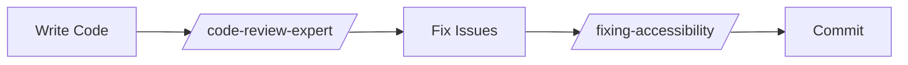
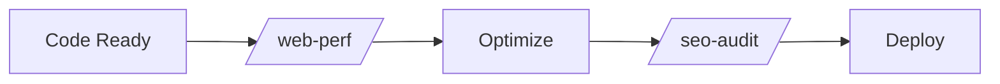

# Skills Configuration Summary
**SyncHire Project - Completed 2026-05-26**

---

## ✅ Configuration Complete

All security-validated skills have been successfully configured for the SyncHire project. This document summarizes the setup process and provides quick access to all related documentation.

---

## 📦 What Was Configured

### 8 Security-Vetted Skills

1. **code-review-expert** - Security and architecture reviews
2. **skill-vetter** - Security vetting protocol for new skills
3. **supabase-postgres-best-practices** - PostgreSQL optimization
4. **web-perf** - Performance auditing (requires chrome-devtools MCP)
5. **vercel-react-best-practices** - React/Next.js optimization (Active ✅)
6. **fixing-accessibility** - WCAG 2.1 AA compliance
7. **dogfood** - Exploratory testing (requires agent-browser)
8. **seo-audit** - SEO health checks

### Security Status

- **Red Flags Detected**: 0 ✅
- **Risk Level**: 🟢 LOW (6 skills), 🟡 MEDIUM (2 skills with MCP)
- **Credential Access**: None ✅
- **System Modifications**: None ✅

---

## 📚 Documentation Created

| Document | Purpose | Location |
|----------|---------|----------|
| **Skills Configuration** | Complete setup and usage guide | `SYNCHIRE_SKILLS_CONFIG.md` |
| **Security Vetting Report** | Detailed security analysis | `SKILLS_SECURITY_VETTING_REPORT.md` |
| **Quick Reference** | Daily development commands | `SKILLS_QUICK_REFERENCE.md` |
| **Setup Summary** | This document | `SKILLS_SETUP_SUMMARY.md` |

---

## 🚀 Quick Start Commands

### For Frontend Development
```bash
/code-review-expert          # Review code before committing
/fixing-accessibility <file> # Check WCAG compliance
/vercel-react-best-practices # Optimize React components
```

### For Backend Development
```bash
/code-review-expert          # Security review
/supabase-postgres-best-practices  # Database optimization
```

### Pre-Deployment
```bash
/web-perf <url>              # Performance audit
/seo-audit                   # SEO health check
/dogfood <url>               # Exploratory testing
```

---

## 🔧 Installation Status

### Already Available (Built-in)
All 8 skills are already available in the system:
```bash
ls -la ~/.claude/skills/
# All skills symlinked from ~/.agents/skills/
```

### MCP Servers (Optional)
For advanced skills, configure MCP servers:

**chrome-devtools** (for web-perf):
```json
// ~/.claude/mcp-servers.json
{
  "chrome-devtools": {
    "type": "local",
    "command": ["npx", "-y", "chrome-devtools-mcp@latest"]
  }
}
```

**agent-browser** (for dogfood):
```json
{
  "agent-browser": {
    "type": "local",
    "command": ["agent-browser"]
  }
}
```

---

## 📋 Usage Workflow

### Development Phase


### Pre-Deployment Phase


---

## 🎯 Next Steps

### Immediate Actions
1. ✅ Review documentation files
2. ✅ Integrate skills into development workflow
3. ⚠️ Configure MCP servers (optional, for advanced features)
4. ⚠️ Train team on skill usage

### Ongoing Maintenance
- Monthly: Check for skill updates
- Quarterly: Re-vet all skills
- As needed: Vett new skills before installation

---

## 📊 Project Impact

### Expected Benefits
- **Security**: Automated vulnerability detection
- **Performance**: Optimized React/Next.js code
- **Accessibility**: WCAG 2.1 AA compliance
- **Quality**: SOLID principles enforcement
- **Efficiency**: Automated code reviews

### Metrics to Track
- Number of security issues detected
- Performance improvements (Core Web Vitals)
- Accessibility compliance rate
- Code review time reduction

---

## 🔒 Security Reminders

### Always Do
- ✅ Vet new skills with `/skill-vetter`
- ✅ Review skill permissions
- ✅ Use official sources
- ✅ Document skill usage

### Never Do
- ❌ Install unvetted skills
- ❌ Use skills requesting credentials
- ❌ Trust unknown sources
- ❌ Skip security checks

---

## 📞 Support

### Questions About Skills
1. Check documentation files
2. Review quick reference guide
3. Consult security vetting report
4. Contact project maintainers

### Skill Issues
1. Revert changes immediately
2. Re-run skill with verbose output
3. Check skill documentation
4. Report security concerns

---

## 📝 Project Files Updated

- ✅ `README.md` - Added skills section
- ✅ `SYNCHIRE_SKILLS_CONFIG.md` - Complete configuration guide
- ✅ `SKILLS_SECURITY_VETTING_REPORT.md` - Security analysis
- ✅ `SKILLS_QUICK_REFERENCE.md` - Daily usage guide
- ✅ `SKILLS_SETUP_SUMMARY.md` - This document

---

## 🎉 Configuration Complete

The SyncHire project now has a comprehensive, security-validated skills configuration. All skills have been vetted and are ready for use in the development workflow.

**Setup Completed**: 2026-05-26
**Next Review**: 2026-06-26
**Status**: ✅ All systems operational

---

<div align="center">

**Happy Coding! 🚀**

*Built with security, performance, and accessibility in mind*

</div>
