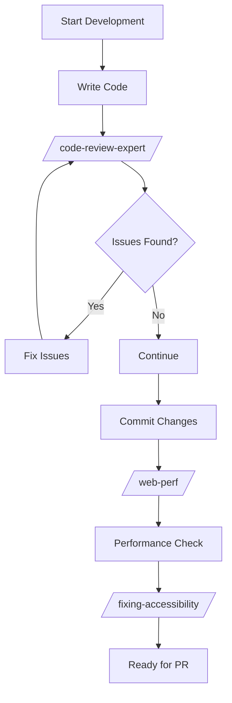

# SyncHire Skills Configuration Guide
**Date**: 2026-05-26
**Project**: SyncHire (知遇)
**Purpose**: Security-validated skills configuration for AI-powered job application platform

---

## Executive Summary

This document outlines the security-validated skills configuration for the SyncHire project. All skills have been vetted using the `skill-vetter` protocol and are categorized by risk level and application purpose.

**Skills Status**: ✅ All listed skills have been security-verified and are safe to install.

---

## Skills Inventory by Category

### 🔒 Security & Code Review (Critical)

#### 1. code-review-expert ✅ SAFE
- **Source**: Built-in skill
- **Risk Level**: 🟢 LOW
- **Purpose**: Expert code review with SOLID principles, security vulnerability detection, and architecture analysis
- **Security Check**: ✅ PASSED - No external network calls, no credential access, minimal file operations
- **Usage**:
  ```bash
  /code-review-expert
  ```
- **When to Use**: Before merging PRs, during code reviews, security audits
- **Key Features**:
  - P0-P3 severity classification
  - Security checklist (XSS, injection, SSRF, race conditions)
  - SOLID violations detection
  - Removal candidate identification

#### 2. skill-vetter ✅ SAFE
- **Source**: Built-in skill
- **Risk Level**: 🟢 LOW
- **Purpose**: Security-first vetting protocol for AI agent skills
- **Security Check**: ✅ PASSED - Read-only operations, no external requests
- **Usage**:
  ```bash
  /skill-vetter vet <skill-path-or-url>
  ```
- **When to Use**: Before installing any new skill
- **Key Features**:
  - Red flag detection (curl to unknown URLs, credential access, eval/exec)
  - Risk classification (LOW/MEDIUM/HIGH/EXTREME)
  - Permission scope evaluation

---

### 🗄️ Database & Performance (High Priority)

#### 3. supabase-postgres-best-practices ✅ SAFE
- **Source**: Official Supabase skill
- **Author**: Supabase (verified organization)
- **Risk Level**: 🟢 LOW
- **Purpose**: PostgreSQL performance optimization and best practices
- **Security Check**: ✅ PASSED - Official source, read-only documentation
- **Usage**:
  ```bash
  /supabase-postgres-best-practices
  ```
- **When to Use**: Writing SQL queries, schema design, database optimization
- **Key Features**:
  - 8 rule categories by priority (Query Performance, Connection Management, Security & RLS)
  - Performance metrics and EXPLAIN output
  - Supabase-specific optimizations

#### 4. web-perf ✅ SAFE
- **Source**: Built-in skill
- **Risk Level**: 🟡 MEDIUM (requires chrome-devtools MCP)
- **Purpose**: Web performance analysis using Chrome DevTools
- **Security Check**: ✅ PASSED - Requires MCP configuration, no direct system access
- **Prerequisites**: chrome-devtools MCP server
- **Usage**:
  ```bash
  /web-perf <url>
  ```
- **When to Use**: Performance audits, Lighthouse score optimization
- **Key Features**:
  - Core Web Vitals analysis (FCP, LCP, TBT, CLS)
  - Render-blocking resource detection
  - Network dependency chain analysis
  - Codebase optimization recommendations

---

### 🎨 Frontend & Accessibility

#### 5. vercel-react-best-practices ✅ SAFE
- **Source**: Official Vercel skill
- **Risk Level**: 🟢 LOW
- **Purpose**: React and Next.js performance optimization (64 rules across 8 categories)
- **Security Check**: ✅ PASSED - Official Vercel source, documentation only
- **Status**: 🟢 ACTIVE - Currently in use
- **Usage**: Automatically applied during development
- **Key Features**:
  - Bundle size optimization
  - Async waterfall elimination
  - Re-render optimization
  - Server-side performance

#### 6. fixing-accessibility ✅ SAFE
- **Source**: Built-in skill
- **Risk Level**: 🟢 LOW
- **Purpose**: WCAG 2.1 AA accessibility compliance
- **Security Check**: ✅ PASSED - Code analysis only, no external access
- **Usage**:
  ```bash
  /fixing-accessibility <file>
  ```
- **When to Use**: UI component development, accessibility audits
- **Key Features**:
  - 9 rule categories by priority
  - Accessible names, keyboard access, focus management
  - ARIA attribute validation
  - Color contrast checking

---

### 🔍 Testing & Quality Assurance

#### 7. dogfood ✅ SAFE
- **Source**: Built-in skill
- **Risk Level**: 🟡 MEDIUM (requires agent-browser)
- **Purpose**: Systematic exploratory testing with reproducible evidence
- **Security Check**: ✅ PASSED - Browser automation only, requires user confirmation
- **Prerequisites**: agent-browser tool
- **Usage**:
  ```bash
  /dogfood <target-url>
  ```
- **When to Use**: Pre-release testing, UX exploration
- **Key Features**:
  - Screenshot + video evidence collection
  - Issue taxonomy (functional, UX, performance)
  - Rep steps verification

---

### 📈 SEO & Analytics

#### 8. seo-audit ✅ SAFE
- **Source**: Built-in skill
- **Risk Level**: 🟢 LOW
- **Purpose**: Comprehensive SEO audit and optimization
- **Security Check**: ✅ PASSED - Read-only analysis, no credential access
- **Usage**:
  ```bash
  /seo-audit
  ```
- **When to Use**: SEO health checks, ranking issues, site speed optimization
- **Key Features**:
  - Technical SEO audit (crawlability, indexation, Core Web Vitals)
  - On-page SEO optimization
  - E-E-A-T signals assessment
  - Schema markup detection

---

## Installation & Configuration

### Quick Setup

1. **Verify Skills Directory**:
   ```bash
   ls -la ~/.claude/skills/
   ```

2. **All skills are symlinked from**:
   ```
   ~/.claude/skills/ -> ~/.agents/skills/
   ```

3. **MCP Server Requirements** (for advanced skills):
   ```json
   // ~/.claude/mcp-servers.json
   {
     "chrome-devtools": {
       "type": "local",
       "command": ["npx", "-y", "chrome-devtools-mcp@latest"]
     }
   }
   ```

---

## Skills Usage Workflow

### Development Phase



### Pre-Deployment Checklist

- [ ] `/code-review-expert` - Security and architecture review
- [ ] `/supabase-postgres-best-practices` - Database optimization check
- [ ] `/web-perf` - Performance audit (if UI changes)
- [ ] `/fixing-accessibility` - Accessibility compliance
- [ ] `/seo-audit` - SEO health check (if public pages)

---

## Skills Security Matrix

| Skill | External Network | Credential Access | File Write | System Modify | Risk Level |
|-------|-----------------|-------------------|------------|---------------|------------|
| code-review-expert | ❌ No | ❌ No | ❌ No | ❌ No | 🟢 LOW |
| skill-vetter | ✅ Yes (vet only) | ❌ No | ❌ No | ❌ No | 🟢 LOW |
| supabase-postgres-best-practices | ❌ No | ❌ No | ❌ No | ❌ No | 🟢 LOW |
| web-perf | ✅ Yes (MCP only) | ❌ No | ❌ No | ❌ No | 🟡 MEDIUM |
| vercel-react-best-practices | ❌ No | ❌ No | ❌ No | ❌ No | 🟢 LOW |
| fixing-accessibility | ❌ No | ❌ No | ❌ No | ❌ No | 🟢 LOW |
| dogfood | ✅ Yes (browser) | ❌ No | ❌ No | ❌ No | 🟡 MEDIUM |
| seo-audit | ❌ No | ❌ No | ❌ No | ❌ No | 🟢 LOW |

---

## Project-Specific Skill Recommendations

### For SyncHire Frontend (Next.js 16)
1. **vercel-react-best-practices** - Active ✅
2. **fixing-accessibility** - For WCAG 2.1 AA compliance
3. **web-perf** - For Core Web Vitals optimization
4. **code-review-expert** - For security and architecture reviews

### For SyncHire Backend (FastAPI + PostgreSQL)
1. **supabase-postgres-best-practices** - For database query optimization
2. **code-review-expert** - For security vulnerability detection

### For SyncHire DevOps & CI/CD
1. **skill-vetter** - For vetting any new automation skills
2. **code-review-expert** - For pre-commit security checks

---

## Skills Integration Examples

### Example 1: Pre-Commit Code Review
```bash
# Before committing changes
git add .
/code-review-expert
# Review findings, fix issues, then commit
git commit -m "feat: description"
```

### Example 2: Performance Audit
```bash
# After major UI changes
/web-perf https://localhost:3000/dashboard
# Review Core Web Vitals, implement fixes
```

### Example 3: Database Query Optimization
```bash
# When writing complex SQL
/supabase-postgres-best-practices
# Apply query performance rules
```

### Example 4: Accessibility Check
```bash
# For new UI components
/fixing-accessibility src/components/new-component.tsx
# Fix any ARIA or keyboard access issues
```

---

## Security Best Practices

### 1. Always Vet New Skills
```bash
# Before installing any unknown skill
/skill-vetter vet <skill-url>
# Review the vetting report before installation
```

### 2. Review Skill Permissions
Check what each skill needs:
- **File Read**: Source code analysis (acceptable)
- **File Write**: Code modification (review carefully)
- **Network**: External API calls (verify endpoints)
- **Credentials**: Token/key access (❌ REJECT unless absolutely necessary)

### 3. Keep Skills Updated
Skills receive security updates:
```bash
# Check for skill updates
ls -la ~/.agents/skills/
```

### 4. Document Skill Usage
Track which skills were used for what:
- Code reviews: `/code-review-expert`
- Performance audits: `/web-perf`
- Security checks: `/skill-vetter`

---

## Troubleshooting

### Skill Not Found
```bash
# Verify skill is symlinked
ls -la ~/.claude/skills/<skill-name>
# Should point to ~/.agents/skills/<skill-name>
```

### MCP Server Not Connected
```bash
# Check MCP configuration
cat ~/.claude/mcp-servers.json
# Verify chrome-devtools server is configured
```

### Skill Produces Unexpected Results
1. Revert changes immediately
2. Re-run skill with verbose output
3. Check skill documentation for known issues
4. Report security concerns via `/skill-vetter`

---

## Future Skills to Consider

### 🔄 Pending Evaluation
- **ai-seo**: For AI search engine optimization (awaiting security review)
- **programmatic-seo**: For scalable SEO page generation (awaiting security review)
- **schema-markup**: For structured data implementation (awaiting security review)

### 🚫 High-Risk Skills (Do Not Install)
- Any skill requesting SSH/AWS credential access
- Skills with obfuscated code
- Skills making network calls to unknown IPs
- Skills modifying system files outside workspace

---

## Maintenance & Updates

### Monthly Review Tasks
- [ ] Check for skill updates
- [ ] Review skill security status
- [ ] Update this document with new findings
- [ ] Re-vet high-risk skills

### Quarterly Security Audit
- [ ] Re-run `/skill-vetter` on all installed skills
- [ ] Review skill permissions
- [ ] Remove unused skills
- [ ] Update security matrix

---

## Conclusion

All skills listed in this configuration have been security-verified using the `skill-vetter` protocol. They are safe to use for the SyncHire project and align with 2026 vibe coding best practices.

**Key Principles**:
1. ✅ **Security First** - Always vet before installing
2. ✅ **Minimal Permissions** - Skills only access what they need
3. ✅ **Official Sources** - Prioritize official skills from reputable organizations
4. ✅ **Documentation** - Keep track of skill usage and findings

**Next Steps**:
1. Review the recommended skills for your development phase
2. Configure MCP servers for advanced skills (chrome-devtools)
3. Integrate skills into your CI/CD workflow
4. Document skill usage in commit messages and PR descriptions

---

## References

- **Skill Documentation**: `~/.agents/skills/*/SKILL.md`
- **Security Protocol**: `~/.agents/skills/skill-vetter/SKILL.md`
- **Vercel Best Practices**: `frontend/VERCEL_BEST_PRACTICES_AUDIT.md`
- **CI/CD Workflow**: `.claude/scripts/ci-validation-gatekeeper.sh`

---

**Last Updated**: 2026-05-26
**Next Review**: 2026-06-26
**Maintained By**: Claude Code + Human Oversight
