# Dogfood Report: SyncHire

| Field | Value |
|-------|-------|
| **Date** | 2026-06-07 17:51 CST |
| **Last Updated** | 2026-06-07 19:02 CST |
| **App URL** | http://localhost:3000 |
| **Session** | synchire-local |
| **Scope** | Full app exploratory QA: navigation, upload, JD creation, search, applications, dashboard, data/settings/auth pages, desktop/mobile responsiveness, console/network errors |

## Summary

| Metric | Count |
|--------|-------|
| Original Findings | 5 |
| Fixed Findings | 5 |
| Current Open Findings | 0 |

## Final Verification

| Check | Result |
|-------|--------|
| Backend strict pytest | Passed: 344 tests with `-W error` |
| Backend lint/format/security | Passed: `ruff`, `black --check`, `bandit`, `pip check`, `pip-audit -s osv` |
| Frontend static/unit/integration | Passed: type-check, ESLint `--max-warnings=0`, 320 unit tests, 18 integration tests |
| Frontend E2E/build | Passed: 13 Playwright tests and production build |
| User-route dogfood sweep | Passed: 13 routes on desktop and mobile, all HTTP 200, zero console errors/warnings, no 404 text |

## Issues

<!-- Copy this block for each issue found. Interactive issues need video + step-by-step screenshots. Static issues (typos, visual glitches) only need a single screenshot -- set Repro Video to N/A. -->

### ISSUE-001: Lite dashboard emits backend fetch errors when the API is not running

| Field | Value |
|-------|-------|
| **Severity** | medium |
| **Category** | console / ux |
| **URL** | http://localhost:3000/dashboard |
| **Repro Video** | N/A |
| **Status** | Fixed and verified |

**Description**

The Lite dashboard is presented as a local/private mode, but on first load it still attempts to call `http://localhost:8000/api/resumes`, `/api/jds`, and `/api/applications`. When the backend is not running, the page visually falls back to empty dashboard data but the browser console records multiple `TypeError: Failed to fetch` errors and `Failed to load dashboard data`. A local-first user would expect no backend error noise when the UI is usable without the API.

**Fix / Verification**

Dashboard data now comes from the local store in Lite mode. Verified by Playwright E2E offline fallback and final desktop/mobile route sweep: `/dashboard` returned 200 with zero console errors/warnings.

**Repro Steps**

1. Start only the frontend with `npm run dev` and navigate to `http://localhost:3000`.
   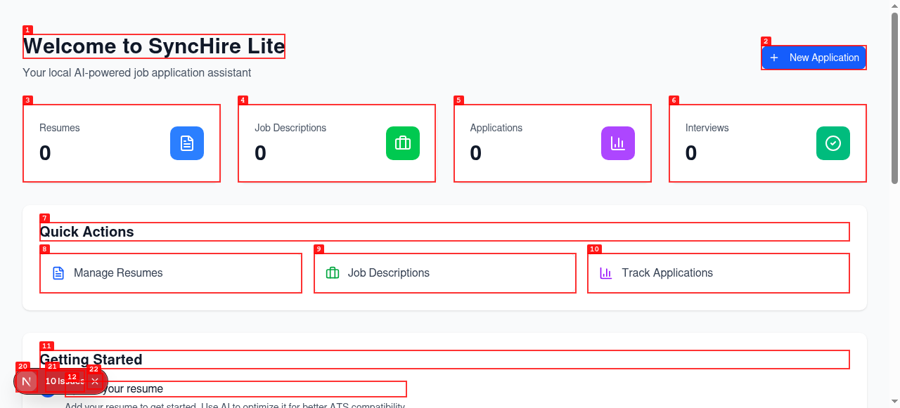

2. Observe that the UI redirects to `/dashboard` and renders an empty Lite dashboard, but the browser console contains failed API requests to `localhost:8000` for resumes, job descriptions, and applications.

---

### ISSUE-002: Dashboard resume entry points route users to a 404 page

| Field | Value |
|-------|-------|
| **Severity** | high |
| **Category** | functional / ux |
| **URL** | http://localhost:3000/dashboard |
| **Repro Video** | N/A |
| **Status** | Fixed and verified |

**Description**

The dashboard exposes "Resumes 0" and "Manage Resumes" as primary onboarding actions, but clicking the resume management entry sends the user to a missing page. A new user trying to start by managing resumes reaches the localized 404 screen ("页面未找到") instead of a resume upload/list workflow.

**Fix / Verification**

Dashboard resume entry points now route to `/upload`, and `/resumes` redirects to `/upload`. Verified by E2E routing coverage and final route sweep with no 404 text.

**Repro Steps**

1. Navigate to `http://localhost:3000/dashboard`.
   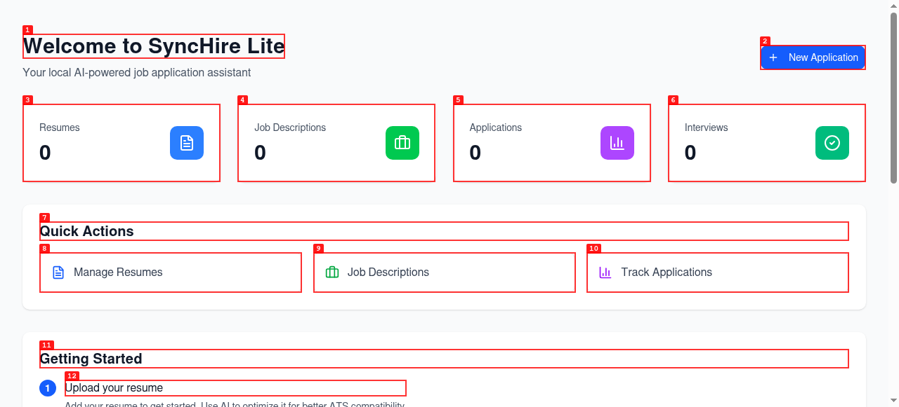

2. Click the "Manage Resumes" dashboard action or the "Resumes 0" stat card.
   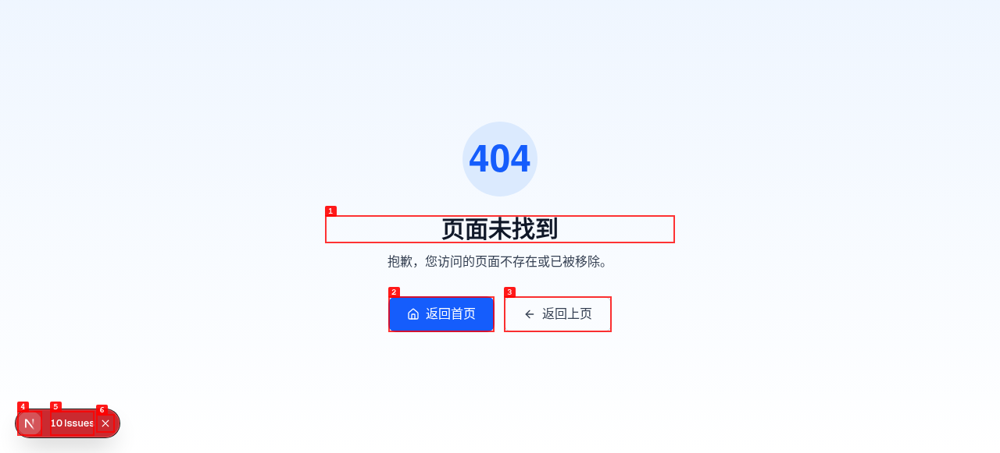

3. **Observe:** the app shows the 404 page instead of a resume management page.

---

### ISSUE-003: Resume upload accepts unsupported and oversized files without feedback

| Field | Value |
|-------|-------|
| **Severity** | medium |
| **Category** | form validation / ux |
| **URL** | http://localhost:3000/upload |
| **Repro Video** | N/A |
| **Status** | Fixed and verified |

**Description**

The upload page states that only PDF, DOC, DOCX, and TXT files up to 10MB are supported. When an unsupported `.xyz` file or an 11MB `.txt` file is selected through the file input, the UI only displays the selected filename and does not show an error, rejection message, or recovery guidance. A user who drags in an unsupported file would not know whether the app accepted, ignored, or failed to process it.

**Fix / Verification**

Upload validation now rejects unsupported extensions and files larger than 10MB with visible messages while keeping the user on `/upload`. Verified by `file-upload.spec.ts`.

**Repro Steps**

1. Navigate to `http://localhost:3000/upload`.
   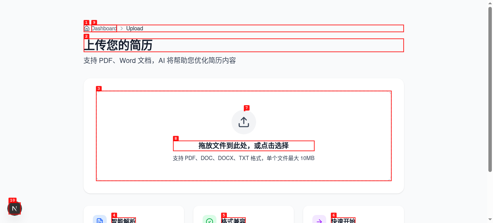

2. Select `unsupported-resume.xyz`.
   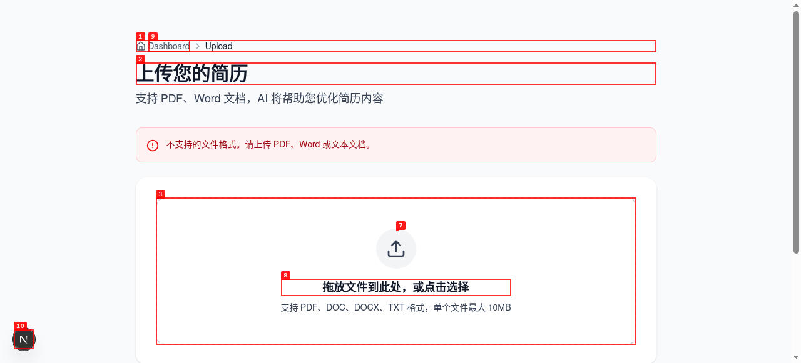

3. Reload the page and select `oversize-resume.txt` (11MB).
   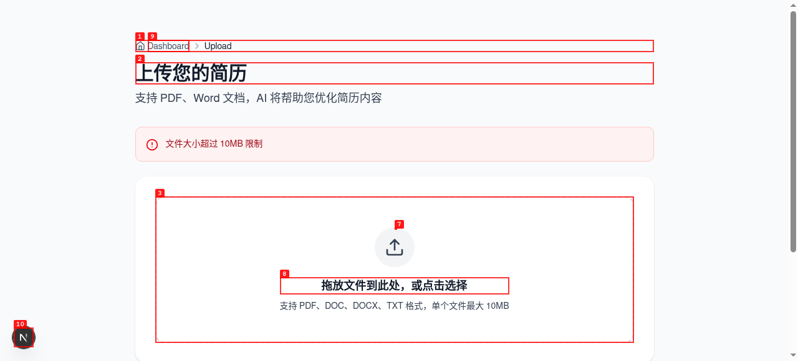

4. **Observe:** both invalid inputs leave the user on the upload page with only the filename visible and no validation message.

---

### ISSUE-004: Uploaded resume cannot be persisted into the dashboard workflow

| Field | Value |
|-------|-------|
| **Severity** | high |
| **Category** | functional / data persistence |
| **URL** | http://localhost:3000/upload |
| **Repro Video** | N/A |
| **Status** | Fixed and verified |

**Description**

A valid TXT resume opens in the resume editor, but the initial "保存" button is disabled. If the user edits the content, the button becomes enabled and can be clicked, but returning to the dashboard still shows `Resumes 0`. This blocks the core path of uploading a resume and then creating an application from that resume.

**Fix / Verification**

Uploaded resumes are now persisted to `synchire-storage`, hydrated on reload, and visible from dashboard/application creation flows. Verified by upload E2E, application creation E2E, and final seeded route sweep.

**Repro Steps**

1. Navigate to `http://localhost:3000/upload` and select `sample-resume.txt`.
   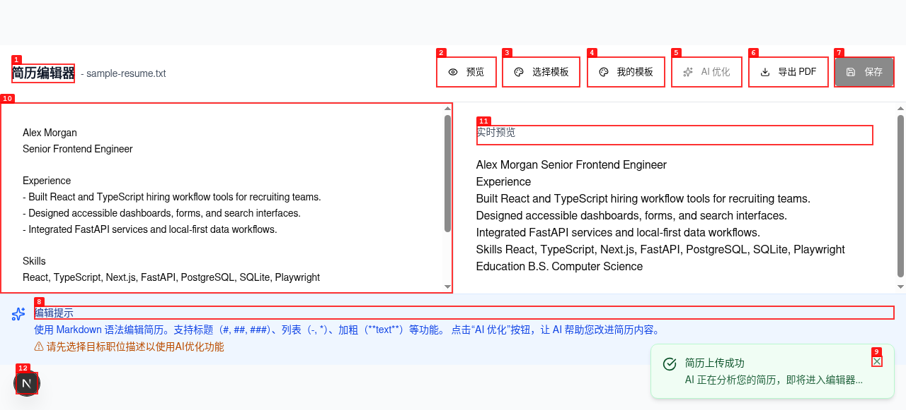

2. Return to the dashboard without editing.
   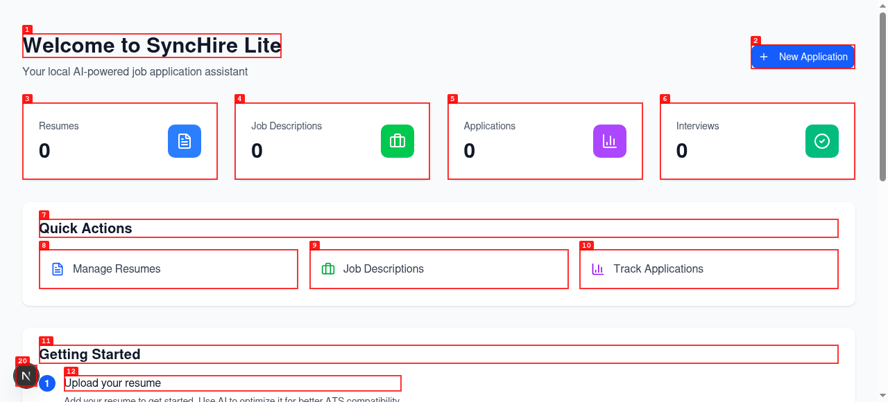

3. Upload the same valid resume again, make a small edit so "保存" becomes enabled, and click "保存".
   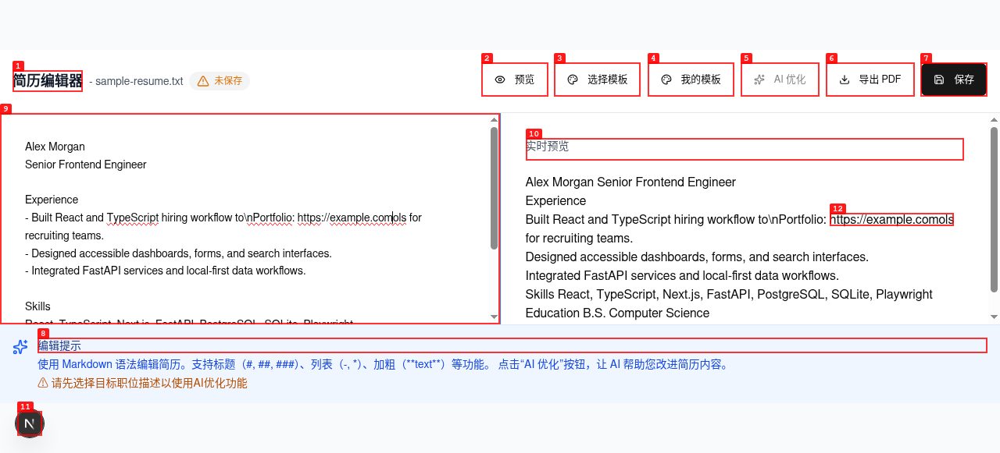
   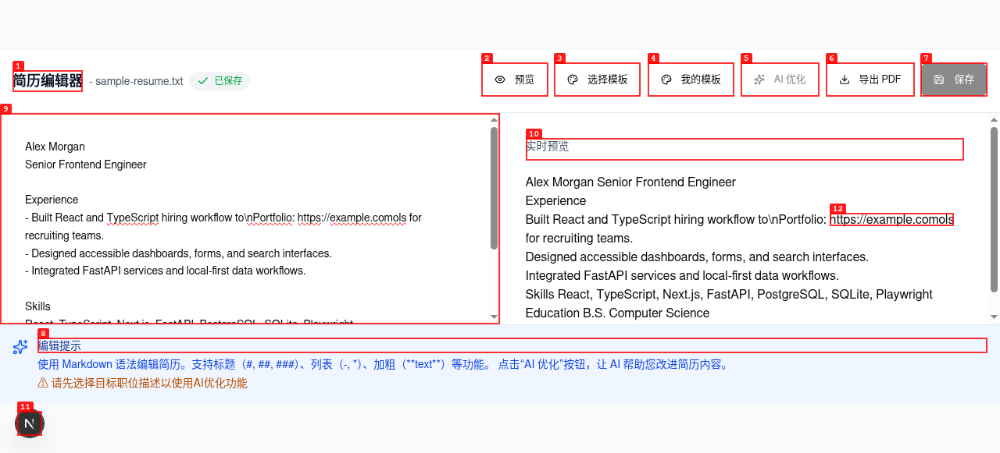

4. Return to the dashboard.
   

5. **Observe:** the dashboard still shows `Resumes 0`.

---

### ISSUE-005: Job URL import silently clears the input without feedback

| Field | Value |
|-------|-------|
| **Severity** | medium |
| **Category** | functional / ux |
| **URL** | http://localhost:3000/jd-input |
| **Repro Video** | N/A |
| **Status** | Fixed and verified |

**Description**

The "从招聘网站导入" flow enables the import button once a URL is entered. Clicking "导入" clears the URL field, but the form is not populated and no success, error, loading, or unsupported-feature message is shown. A user trying to import a job posting loses their entered URL and has no next step.

**Fix / Verification**

URL import now preserves the entered URL and explains that automatic import is unavailable for the link, without clearing manual fields. Verified by `file-upload.spec.ts`.

**Repro Steps**

1. Navigate to `http://localhost:3000/jd-input`.
   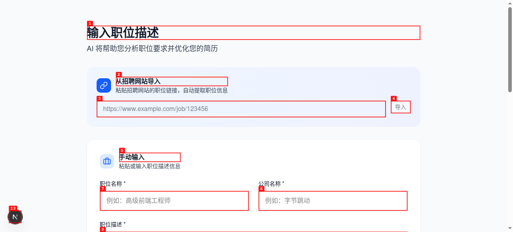

2. Enter a job URL.
   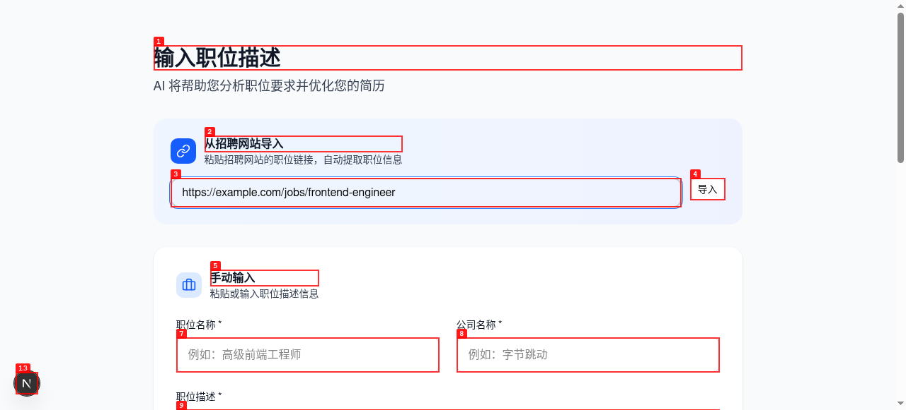

3. Click "导入".
   

4. **Observe:** the URL field is cleared and no job data or error message appears.

---
